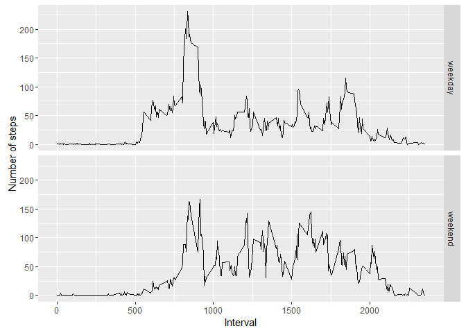

# Reproducible Research: Peer Assessment 1


## Loading and preprocessing the data

```r
  unzip("activity.zip")
  dat1 <- read.csv("activity.csv", sep = ",")
  dat1$date <- as.Date(dat1$date)
```

### Loading any packages that are used in the analysis

```r
 library("dplyr")
```

```
## 
## Attaching package: 'dplyr'
```

```
## The following objects are masked from 'package:stats':
## 
##     filter, lag
```

```
## The following objects are masked from 'package:base':
## 
##     intersect, setdiff, setequal, union
```

```r
  library("ggplot2")
```

## What is mean total number of steps taken per day?  
* stepsperday houses the total number of steps taken per day
* the ggplot command builds a histogram of the number of steps taken each day
* Finally, steps_mean_med will house the mean and median number of the total steps taken per day

```r
  stepsperday <- dat1 %>% group_by(date) %>% summarise(steps_day = sum(steps, na.rm = TRUE))
  ggplot(data = stepsperday, aes(x=steps_day)) + geom_histogram()
```

```
## `stat_bin()` using `bins = 30`. Pick better value with `binwidth`.
```

<!-- -->

```r
  steps_mean_med <- stepsperday %>% summarise(avg = mean(steps_day), med = median(steps_day))
  print(steps_mean_med)
```

```
## # A tibble: 1 × 2
##       avg   med
##     <dbl> <int>
## 1 9354.23 10395
```

## What is the average daily activity pattern?

```r
  int5 <- dat1 %>% group_by(interval) %>% summarise(steps = mean(steps, na.rm = TRUE))
  plot(int5$interval, int5$steps, type ="l", xlab = "Interval", ylab = "Average steps per day")
```

<!-- -->

```r
  max_interval <- subset(int5, steps == max(steps))
  print(max_interval)
```

```
## # A tibble: 1 × 2
##   interval    steps
##      <int>    <dbl>
## 1      835 206.1698
```

## Imputing missing values

```r
## Number of NA values
total_na <- sum(is.na(dat1))
print(total_na)
```

```
## [1] 2304
```

```r
## Filling in NA values
dat2 <- dat1 %>% group_by(interval) %>% mutate(avg = mean(steps, na.rm = TRUE))
dat2 <- dat2 %>% mutate(steps_new = ifelse(is.na(steps), avg, steps)) %>% select(steps_new, date, interval)

## New total steps per day
  stepsperday2 <- dat2 %>% group_by(date) %>% summarise(steps_day = sum(steps_new, na.rm = TRUE))
  ggplot(data = stepsperday2, aes(x=steps_day)) + geom_histogram()
```

```
## `stat_bin()` using `bins = 30`. Pick better value with `binwidth`.
```

<!-- -->

```r
  steps_mean_med2 <- stepsperday2 %>% summarise(avg = mean(steps_day), med = median(steps_day))
  print(steps_mean_med2)
```

```
## # A tibble: 1 × 2
##        avg      med
##      <dbl>    <dbl>
## 1 10766.19 10766.19
```

```r
## Difference to original values
  steps_diff <- steps_mean_med2 - steps_mean_med
  print(steps_diff)
```

```
##        avg      med
## 1 1411.959 371.1887
```


## Are there differences in activity patterns between weekdays and weekends?

```r
## Creating the weekend/weekday variable
dat2 <- dat2 %>% mutate(day = weekdays(date), day_type = as.factor(ifelse(day == "Saturday" | day == "Sunday", "weekend", "weekday")))
dat3 <- dat2 %>% group_by(day_type, interval) %>% summarise(avg = mean(steps_new))

## Creating the panel plot (using ggplot)
  ggplot(dat3, aes(interval, avg)) + geom_line() + facet_grid(day_type ~.) + xlab("Interval") + ylab("Number of steps")
```

<!-- -->
